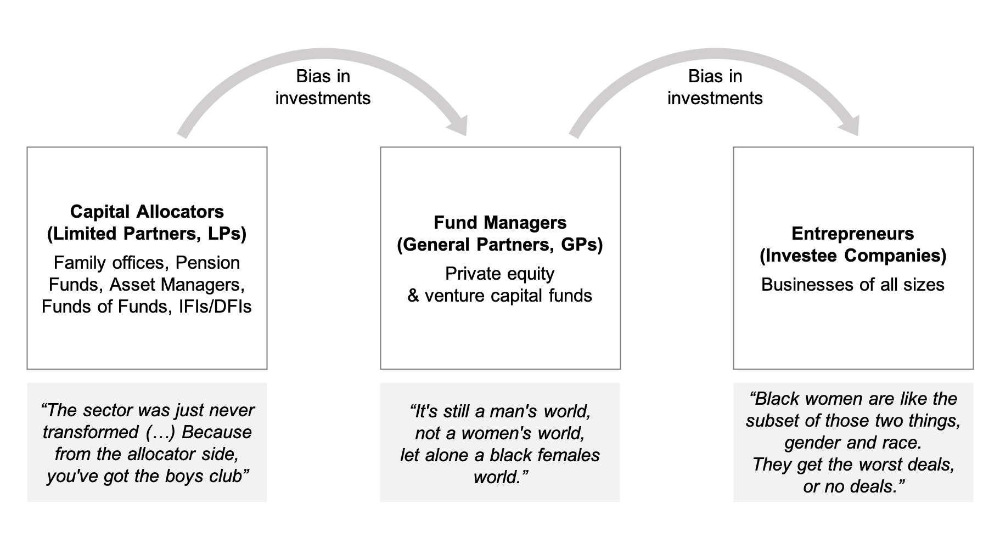

```{r setup, include=FALSE}
knitr::opts_chunk$set(echo = FALSE)
```


## Abstract: Our Research at a Glance {-}

-  This paper contributes to current debates in the field of entrepreneurship on the persistent gender gap in capital allocation to entrepreneurs. 
-  Drawing on recent theories of entrepreneurial belonging (@stead_2017; @birkner_2020), we conducted narrative research to gain rare insights into the gendered challenges faced by female fund managers in private equity in Sub-Saharan Africa during the fundraising process. 
-  We discover a triple dissonance between the feminine normative frames of womanhood and the male normative frames of entrepreneurship and private equity, compounded by intersectional stereotypes of Africa. 

## Abstract: Our Contribution

- Our research offers novel, exploratory insights into what has been a blind spot in the emerging field of gender-lens investing: how gender bias in capital allocation to entrepreneurs is reinforced by gender bias in capital allocation to fund managers. 
-  We conclude that the field must move beyond viewing African women as beneficiaries of empowerment and put them in power of investment decisions.

> *Empowerment is receiving capital to grow a business. <br>
Power is deciding how capital is allocated and which businesses grow.*

## Introduction

-  The gender gap in capital allocation to women entrepreneurs globally is well documented (@brush_2018; @kanze_2018). Recent scholarship has deepened our understanding of how structural barriers and gender bias are drivers of the gender gap in entrepreneurship finance. 
-  Gender lens investing has emerged as a global trend among investors to close this gap by promoting investments in women-owned and -led businesses. This has led to an unprecedented focus among investment practitioners and policy-makers on women entrepreneurs as beneficiaries of investments. 
-  Interestingly enough, the question of who holds power over investment decisions has remained largely unchallenged. This raises the question whether the gender gap in entrepreneurship finance can be truly overcome while the gender gap on the capital allocators’ side persists. 

## Objectives

This paper focuses on two central research questions:

-  What are the gendered challenges female fund managers in Sub-Saharan Africa experience during the fundraising process in the male-dominated field of private equity? 

-  How is their belonging challenged when female fund managers seek to disrupt the way capital is allocated to entrepreneurs?

## Approach

-  Narrative interviews (@creswell_2017; @riessman_2008) with 23 female fund managers in Sub-Saharan Africa (SSA)

- No public data available on the total number of female fund managers in SSA. We conducted a mapping of the universe via desk research, direct outreach to networks, and snowball sampling. We identified a total of 28 women-led funds in VC and PE in SSA.

- 9 female fund managers in our sample are from South Africa, 6 from West Africa and 5 from East Africa.

- The majority of female fund managers in the region are on the journey to raise their own fund and are still in the fundraising process.

## Figure 1: Capital allocation to fund managers and entrepreneurs 
<center>
{#id .class width=911 height=490.5px}
</center>

## Results

- Our exploratory research has revealed a significant blind spot in the emerging field of gender-lens investing (GLI). GLI has women’s empowerment at its center, yet has a blind spot when it comes to power. 

- The rise in GLI has led investors to focus attention on the promotion of women’s empowerment through investments where women are the beneficiaries rather than the custodians of empowerment. 

> *“[T]hey want to support the end-businesses that are owned by women, but they don't trust that women can allocate capital to those businesses. Yeah, no, it's crazy.”*
> `r tufte::quote_footer('--- (South African female fund manager)')`

## Results

- This approach to GLI bears the risk of ignoring the underlying causes of the gender gap in capital allocation to entrepreneurs. 

- It risks perpetuating gendered stereotypes which assume all women entrepreneurs have micro and small businesses, and it risks ignoring the diversity of women entrepreneurs by subsuming all women in a “pink ghetto” silo.

> *“They [international investors] were not used to two strong African women going to market and saying: 'we're trying to raise a 100 million USD to invest in other women in Africa’, because they thought that African women in the main sell tomatoes on the side of the road.”*
> `r tufte::quote_footer('--- (Pan-African female fund manager)')`

## Conclusion

- While there is now a growing focus on women entrepreneurs as beneficiaries of investments, the industry is still hesitant when it comes to putting money into the hands of female fund managers and giving them the power to make investment decisions. 

- A field of gender-lens investing that is sustainable and scalable must be inclusive and locally rooted. It is therefore crucial to expand the focus from African women as beneficiaries of empowerment to them holding power over investment decisions. 

> *“So the question is: What more are we going to allow women to do in the investment industry?”*
> `r tufte::quote_footer('--- (East African female fund manager)')`

## References

<div id="refs"></div>


